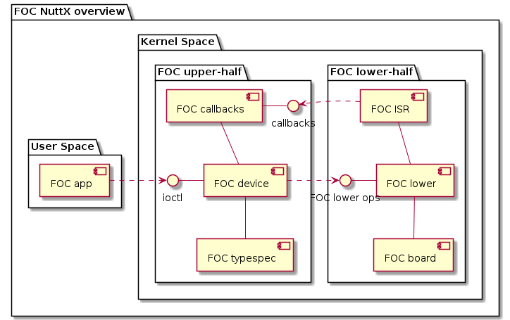
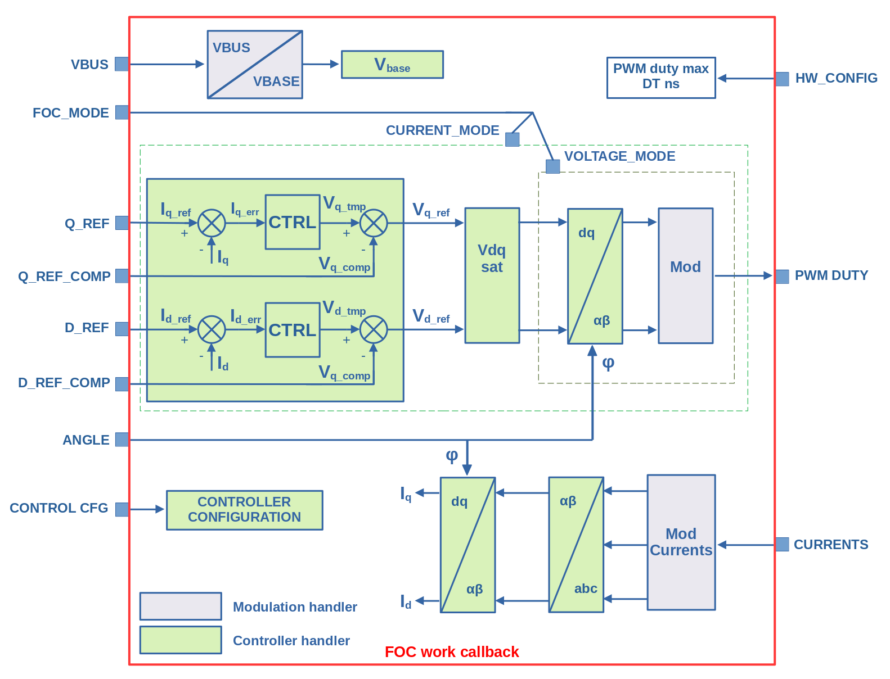

====================
FOC Driver Interface
====================

FOC Driver
===========

Field Oriented Control (FOC) is a common technique to control either synchronous or asynchronous alternating current machines.

The main goal of FOC is to control direct current (Id) and quadrature current (Iq) in powered device.

The Nuttx FOC driver is split into two parts:

#. An "upper half", generic driver that provides the common FOC interface to application level code,
#. A "lower half", platform-specific driver that implemets the low-level logic to implement the FOC functionality

  **Figure 1**. This diagram shows the general architecture of the FOC device

Files supporitng FOC can be found in the following locations:

-  ``include/nuttx/power/foc/foc.h``. Upper-half FOC interface available for user-space.
-  ``include/nuttx/power/foc/foc_lower.h``. Lower-half FOC interface.
-  ``include/nuttx/power/foc/foc_types.h``. Numeric data definitions for FOC.
-  ``include/nuttx/power/foc/foc_typespec.h``. Type-specific FOC interface.
-  ``drivers/power/foc/foc_dev.c``. The generic "upper half" FOC driver
-  ``drivers/power/foc/foc_callbacks.c``. The generic FOC callbacks from "lower half" to "upper half"
-  ``drivers/power/foc/<type-spec-dir>/``. Type-specific controller implementation

FOC needs to perform calculations on real numbers. For this reason, a generalized interface was
introduced to work on different numeric types (``include/nuttx/power/foc/foc_types.h``). For now we support two numeric types:

#. ``float`` - 32-bit floating point numbers
#. ``b16_t`` - 16-bit fixed point numbers

The majority of the functionality available to the application is implemented in driver ioctl calls. Supported ioctl commands:

- ``PWRIOC_START`` - Start the FOC device, arg: none
- ``PWRIOC_STOP`` - Stop the FOC device, arg: none
- ``PWRIOC_SET_MODE`` - Set the FOC device operation mode, arg: int pointer (``enum foc_control_mode_e``)
- ``PWRIOC_GET_STATE`` - Get the FOC device state, arg: ``struct foc_state_s`` pointer.
  This is a blocking operation that is used to synchronize the user space application with a FOC worker.
- ``PWRIOC_CLEAN_FAULT`` - Clean the FOC device fault state, arg: none
- ``PWRIOC_SET_PARAMS`` - Set the FOC device operation parameters, arg: ``struct foc_params_s`` pointer
- ``PWRIOC_GET_PARAMS`` - Get the FOC device operation parameters, arg: ``struct foc_params_s`` pointer
- ``PWRIOC_SET_CONFIG`` - Set the FOC device configuration, arg: ``struct foc_cfg_s`` pointer
- ``PWRIOC_GET_CONFIG`` - Get the FOC device configuration, arg: ``struct foc_cfg_s`` pointer
- ``PWRIOC_GET_INFO`` -  Get the FOC device info, arg: ``struct foc_info_s`` pointer

Supported modulation handlers:

#. 3-phase Space Vector Modulation (``drivers/power/foc/<type-spec-dir>/foc_svm3_xx.c``)

Supported controller handlers:

#. PI current controller (``drivers/power/foc/<type-spec-dir>/foc_picontrol_xx.c``)

  **Figure 2**. This diagram shows the FOC work callback organisation.

FOC Model Driver
================

FOC Model device has been designed to work with the FOC device to simulate the controller's operation without the required hardware.

Files supporitng FOC model can be found in the following locations:

-  ``include/nuttx/power/focmodel/focmodel.h``. Upper-half FOC model interface available for user-space.
-  ``include/nuttx/power/focmodel/focmodel_lower.h``. Lower-half FOC model interface.
-  ``include/nuttx/power/focmodel/focmodel_typespec.h``. Type-specific FOC model interface.
-  ``drivers/power/focmodel/focmodel_dev.c``. The generic "upper half" FOC model driver.
-  ``drivers/power/focmodel/focmodel_callbacks.c``. The generic FOC model callbacks from "lower half " to "upper half"
-  ``drivers/power/focmodel/<type-spec-dir>/``. Type-specific model implementation

Supported FOC models:
#. Permanent Magnet Synchronous Motor (PMSM)
